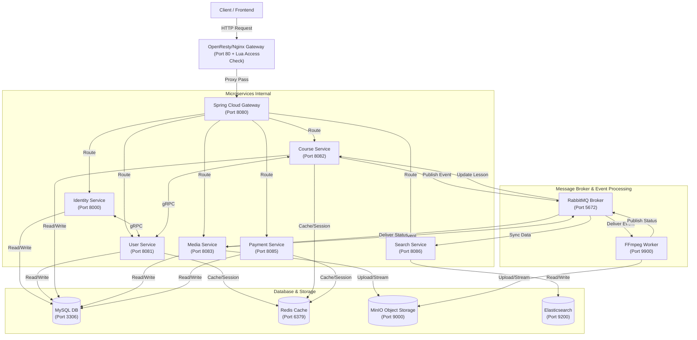
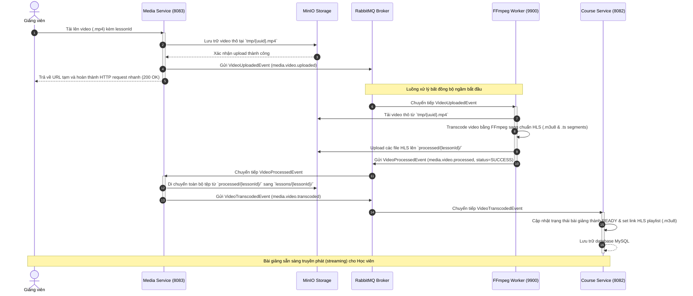
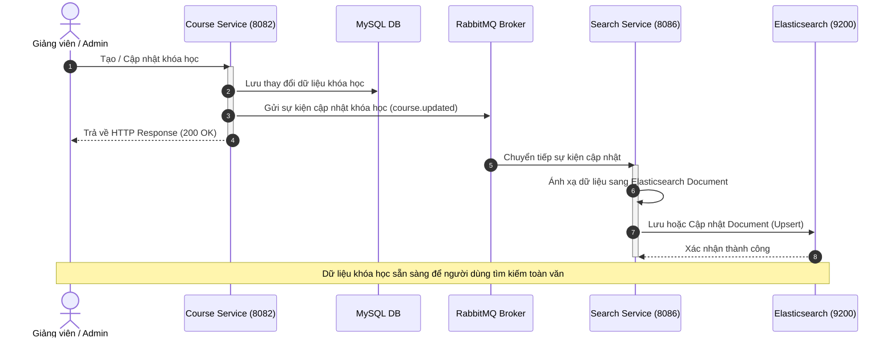

# Uniwise Backend - Hệ thống E-learning Microservices

Dự án **Uniwise Backend** là hệ thống máy chủ cung cấp giải pháp E-learning toàn diện, được thiết kế theo kiến trúc Microservices hướng sự kiện nhằm đảm bảo hiệu năng cao, khả năng mở rộng tối đa và bảo mật tối ưu cho các tác vụ truyền tải video học trực tuyến.

---

## 1. Dự án giải quyết vấn đề gì? (Problem Statement)
Hệ thống học trực tuyến (E-learning) hiện đại đối mặt với nhiều bài toán khó về hiệu năng, bảo mật và khả năng mở rộng:
- **Tải trọng cực lớn khi xử lý Video**: Quá trình đăng tải và xử lý video dung lượng lớn (transcoding) cực kỳ tiêu tốn CPU và RAM. Nếu thực hiện đồng bộ trên máy chủ nghiệp vụ chính, hệ thống dễ bị quá tải, gây tắc nghẽn hoặc sập các tính năng khác (đăng nhập, mua khóa học, v.v.).
- **Tìm kiếm dữ liệu lớn tốc độ cao (Full-text Search)**: Truy vấn tìm kiếm phức tạp trên CSDL quan hệ (MySQL) không tối ưu về tốc độ, không hỗ trợ tốt tìm kiếm mờ (fuzzy search) và dễ gây quá tải cho DB chính khi lượng người truy cập tăng đột biến.
- **Tối ưu băng thông và Trải nghiệm người dùng**: Truyền phát tệp video thô (`.mp4`) gây tốn băng thông lớn và thời gian chờ tải lâu cho học viên (nhất là khi mạng yếu). Hệ thống cần hỗ trợ phát trực tuyến thích ứng (Adaptive Bitrate Streaming) để tự động điều chỉnh chất lượng theo tốc độ mạng.
- **Bảo mật Nội dung**: Video bài giảng dễ bị tải lậu hoặc chia sẻ bất hợp pháp nếu đường dẫn video gốc hoặc lưu trữ bị lộ.
- **Sự phụ thuộc lẫn nhau giữa các dịch vụ**: Hệ thống cần được thiết kế lỏng lẻo (loose coupling) để đảm bảo khi một dịch vụ gặp sự cố (ví dụ: quá tải upload media), các phần còn lại của ứng dụng vẫn hoạt động bình thường.

**Giải pháp của Uniwise**:
* **Kiến trúc Microservices**: Tách riêng các luồng nghiệp vụ thành các dịch vụ độc lập như Quản lý khóa học (`course-service`), Hồ sơ người dùng (`user-service`), Xác thực (`identity-service`), và Lưu trữ (`media-service`).
* **Xử lý bất đồng bộ qua RabbitMQ & Worker chuyên biệt**: Khi giảng viên đăng tải video, tác vụ chuyển đổi định dạng (transcoding) được gửi qua RabbitMQ đến dịch vụ `ffmpeg-worker` hoạt động độc lập để xử lý ngầm, giúp giải phóng tài nguyên lập tức cho server nghiệp vụ.
* **Đồng bộ dữ liệu & Tìm kiếm với Elasticsearch**: Sử dụng Elasticsearch lưu trữ index khóa học. Khi có thay đổi từ `course-service`, dữ liệu được đồng bộ sang `search-service` qua RabbitMQ theo thời gian thực, đảm bảo tốc độ tìm kiếm siêu tốc và giảm tải cho DB.
* **Stream HLS (HTTP Live Streaming)**: Video được chia nhỏ thành nhiều phân đoạn `.ts` và quản lý bởi danh sách phát `.m3u8`. Điều này vừa giúp tiết kiệm băng thông (tải đến đâu xem đến đó), vừa ngăn chặn việc tải tệp video gốc một cách dễ dàng.
* **OpenResty (Nginx + Lua) Gateway**: Lớp bảo mật ngoài cùng xác thực chữ ký JWT ngay ở biên thông qua Lua script, ngăn các truy cập trái phép tiếp cận sâu hơn vào bên trong các microservice.

---

## 2. Kiến trúc tổng thể (Overall Architecture)
Hệ thống kết hợp mô hình **Event-driven Microservices (Kiến trúc hướng sự kiện)** cho các tác vụ xử lý bất đồng bộ nặng và **gRPC (giao tiếp đồng bộ hiệu năng cao)** cho các truy vấn nội bộ.

### Sơ đồ kiến trúc tổng thể (System Architecture)



---

## 3. Các Tech Stack sử dụng (Technology Stack)

| Tầng / Thành phần | Công nghệ | Vai trò |
| :--- | :--- | :--- |
| **Language & Core** | Java 21, Spring Boot 3.5.15 | Ngôn ngữ phát triển chính và Framework xây dựng ứng dụng |
| **Routing & API Gateway** | OpenResty (Nginx + Lua), Spring Cloud Gateway 2025 | Chặn lọc yêu cầu không hợp lệ từ biên và phân phối request |
| **Communication (Đồng bộ)** | gRPC, Protocol Buffers | Đảm bảo tốc độ giao tiếp nội bộ siêu nhanh giữa các service |
| **Communication (Bất đồng bộ)** | RabbitMQ | Điều phối các sự kiện nghiệp vụ dưới dạng hướng sự kiện |
| **Hệ quản trị CSDL** | MySQL 8 | Lưu trữ thông tin tài khoản, khóa học, dữ liệu quan hệ |
| **Search Engine & Log** | Elasticsearch 9, Kibana 9 | Tìm kiếm Full-text cho khóa học và theo dõi log |
| **Bộ nhớ đệm & Monitor** | Redis 8, RedisInsight | Tăng tốc độ truy xuất thông tin tĩnh và theo dõi cache |
| **Object Storage** | MinIO | Lưu trữ video thô, thumbnail và các tệp HLS đã xử lý |
| **Media Processing** | FFmpeg (Chạy độc lập trên container) | Thực hiện transcode video sang luồng phát chuẩn HLS |
| **Build & Productivity** | Maven, Lombok, MapStruct, Jakarta Validation | Hỗ trợ cấu trúc code gọn gàng, ánh xạ DTO nhanh và kiểm định dữ liệu đầu vào |
| **Triển khai** | Docker, Docker Compose | Đóng gói hạ tầng phát triển đồng nhất giữa các máy local |

---

## 4. Sơ đồ luồng (Flowchart) & Cấu trúc thư mục (Directory Structure)

### 4.1 Quy trình tải lên và xử lý Video bài học (Asynchronous Video Processing Pipeline)
Khi giảng viên tải lên một video mới, luồng dữ liệu bất đồng bộ diễn ra như sau:



---

### 4.2 Quy trình đồng bộ dữ liệu tìm kiếm (Elasticsearch Data Sync Pipeline)
Để đảm bảo dữ liệu luôn nhất quán và cho phép người dùng tìm kiếm toàn văn tốc độ cao, hệ thống đồng bộ ngầm dữ liệu từ MySQL sang Elasticsearch thông qua luồng sự kiện RabbitMQ:



---

### 4.3 Cấu trúc thư mục Backend (Repository Directory Structure)
Mã nguồn backend được phân cấp rõ ràng theo cấu trúc đa module Maven và Docker Compose:

```text
uniwise/backend/
├── agents/                           # Tài liệu hướng dẫn cấu trúc & quy tắc cho AI Agent
│   ├── ARCHITECTURE_REVIEW.md        # Chi tiết kiến trúc module Account mẫu
│   └── GUIDELINE_BACKEND.md          # Các tiêu chuẩn thiết kế và Skeleton code mẫu
├── certificates/                     # Khóa bảo mật SSL và mã hóa phục vụ OpenResty/Nginx
├── contracts/                        # Định nghĩa gRPC Protocol Buffers dùng chung
│   └── proto/
│       └── uniwise/
│           ├── identity/             # Protobuf cho dịch vụ Identity (Xác thực)
│           └── user/                 # Protobuf cho dịch vụ User (Thông tin người dùng)
├── gateway/                          # Spring Cloud Gateway (Port 8080) - Cửa ngõ định tuyến API
├── infrastructure/                   # Cấu hình cài đặt hạ tầng hệ thống
│   └── nginx/                        # Nginx OpenResty tích hợp Lua script để kiểm tra access token ở lớp biên
│       ├── conf/nginx.conf           # File cấu hình Nginx chính
│       └── lua/                      # Script Lua xác thực token
├── platforms/
│   └── java/                         # Mã nguồn dự án Java Spring Boot
│       ├── libs/                     # Các thư viện dùng chung cho các microservice
│       │   ├── common/               # Định nghĩa lỗi, lớp bao ApiResponse chung
│       │   ├── grpc-contracts/       # Mã nguồn Java tự động sinh từ file Protobuf
│       │   ├── grpc-spring-boot-starter/  # Starter tự động cấu hình gRPC Client/Server
│       │   ├── jwt-security-starter/ # Starter tích hợp Spring Security và cấu hình JWT
│       │   ├── platform-event-contract/   # Cấu trúc các Event payload truyền nhận qua RabbitMQ
│       │   └── platform-event-starter/    # Starter tự động cấu hình RabbitMQ Publisher/Subscriber
│       ├── services/                 # Các dịch vụ nghiệp vụ cốt lõi
│       │   ├── course-service/       # Quản lý khóa học, bài học, chương trình học (Port 8082)
│       │   ├── identity-service/     # Quản lý tài khoản, phân quyền, cấp phát token JWT (Port 8000)
│       │   ├── media-service/        # Nhận file upload, lưu trữ tạm và di chuyển tệp tin (Port 8083)
│       │   ├── payment-service/      # Xử lý thanh toán, giỏ hàng, hóa đơn (Port 8085)
│       │   ├── search-service/       # Đồng bộ dữ liệu và tìm kiếm toàn văn khóa học với Elasticsearch (Port 8086)
│       │   └── user-service/         # Quản lý hồ sơ cá nhân và phân quyền gRPC (Port 8081)
│       └── workers/
│           └── ffmpeg-worker/        # Service xử lý video offline và transcode sang HLS (Port 9900)
├── docker-compose.yaml               # Cấu hình container hóa MySQL, Redis, RabbitMQ, MinIO, FFmpeg
└── startup.ps1                       # Script khởi tạo nhanh hạ tầng Docker và khởi chạy đồng loạt các microservice
```
